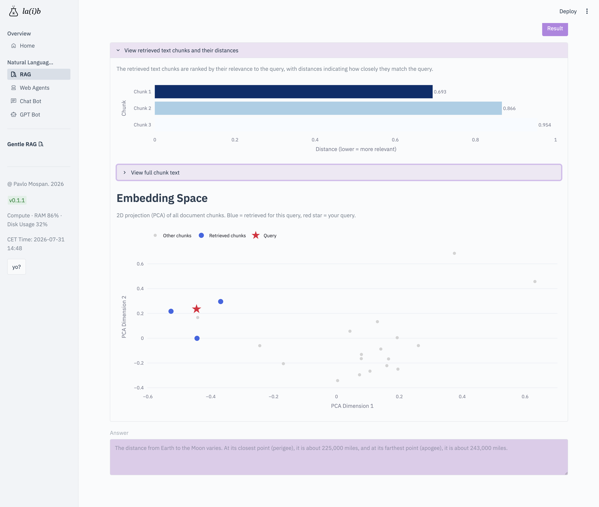
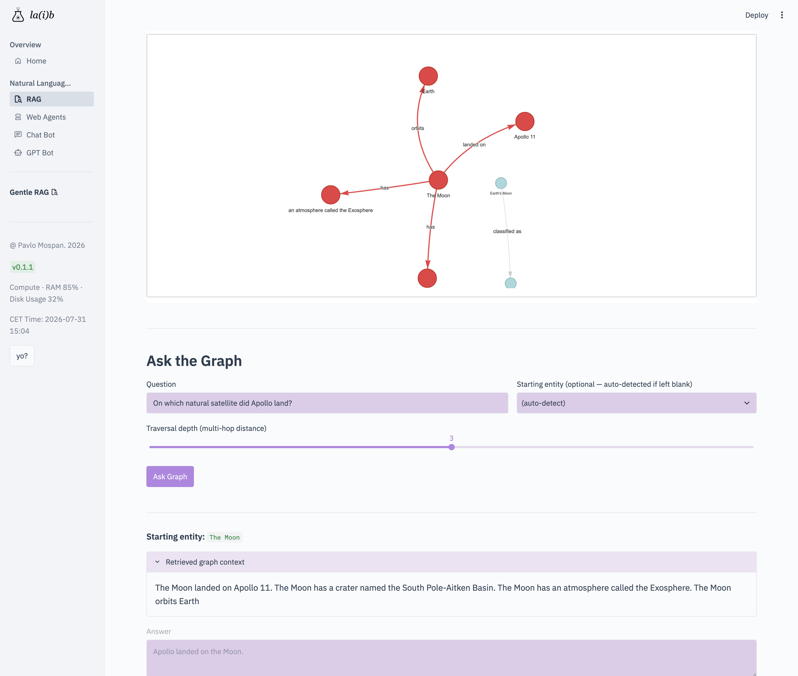
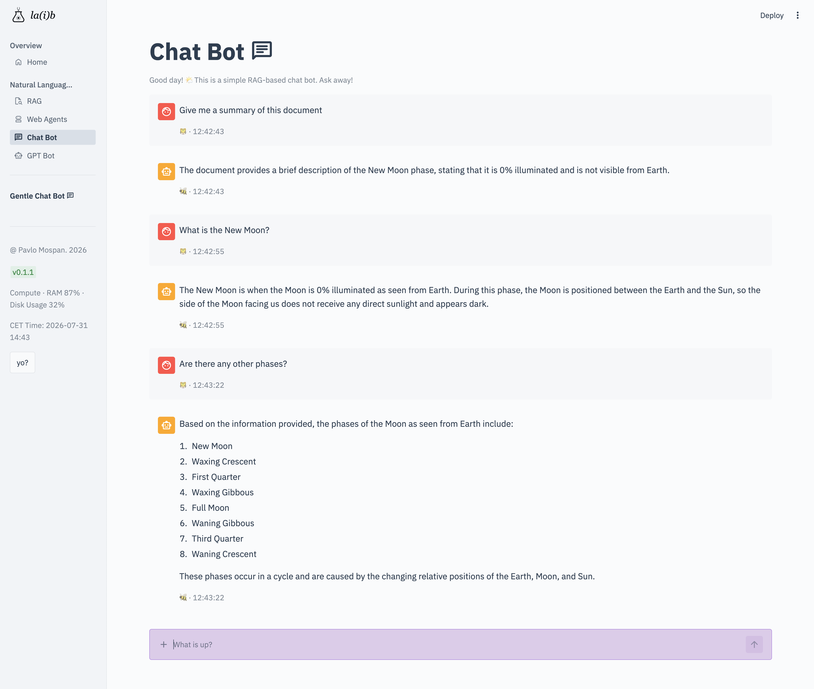
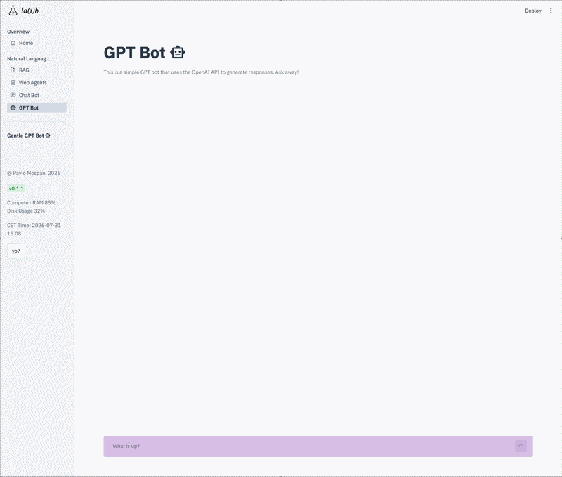

# 🌴 LA(I)B


> A collection of Data Science practices, gathered together in a form of notebooks and Web Application.


## 🧠 Concept

LA(I)B provides comprehensive tools and utilities for building scalable systems with modern development practices.
The idea is to build code that would let test the most recent and modern things locally, on the small machines. Every line of code has been build and tested on `CPX22 — 2 vCPUs, 4 GB RAM` (3,7 Gb + 2Gb swap) - no more swap thrashing, frozen SSH sessions, and killing zombie processes. 

---

## 🎬 Preview

<table>
  <tr>
    <td align="center">
      <br>
      <sub><b>RAG: Distance between similar chunks</b></sub>
    </td>
    <td align="center">
      <br>
      <sub><b>Graphrag</b></sub>
    </td>
    <td align="center">
      <br>
      <sub><b>Chat Bot</b></sub>
    </td>
  </tr>
</table>


### <i>GPT-like Chat Bot</i>


---

## ⚙️ Tech Stack

### UI-App

* Streamlit

### NLP

* LangChain
* HuggingFace
* SentenceTransformers
* OpenAI

---

## 🧮 Getting started

At the moment, the repo supports python virtual environment only.

```bash
git clone https://github.com/ourendingdays/LA-I-B.git
cd LA-I-B

python3 -m venv venv
source venv/bin/activate
pip install -r requirements.txt

bash run_app.sh
```
The app boots on http://localhost:8501. Set HF_TOKEN in .env for Hugging Face inference calls.


## 👨‍💻 Author

**Pavlo Mospan(c) 2017**. Updated 2026

* 💼 Data Scientist / AI Engineer
* 🌍 Augsburg, Germany

---

## ⭐️ Show your support

If you like this project:

* ⭐️ Star the repo
* 🍴 Fork it
* 🧠 Share ideas
