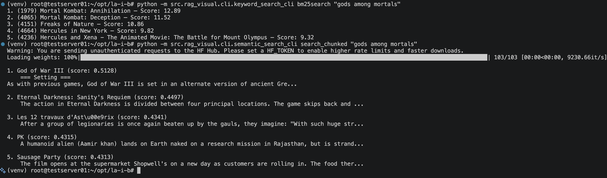
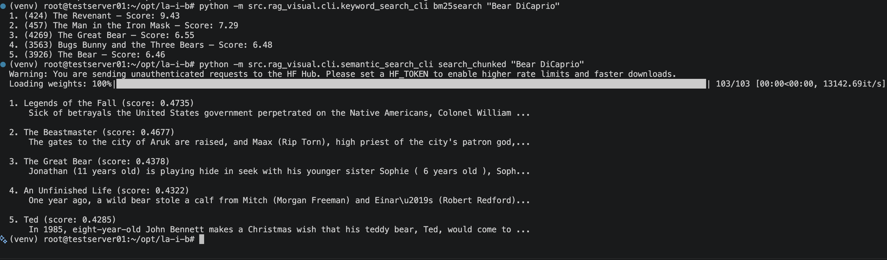
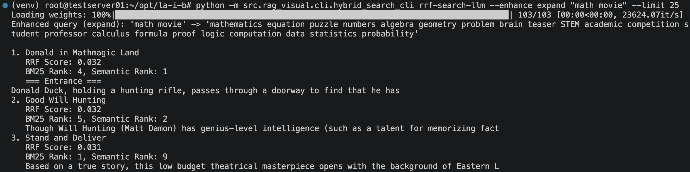
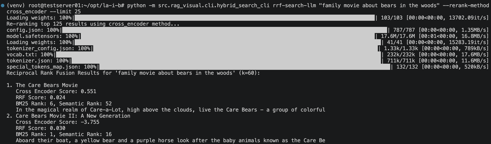

## RAG
### Run the code as a module, not a script

From the project root: 

```bash
python -m src.rag.pipelines.simple_doc_analyzer

python -m src.rag.pipelines.simple_rag

python -m src.rag.pipelines.vector_search_rag

python -m src.rag.pipelines.simple_graphrag

python -m src.assistant.chat_assistant

python -m src.rag.agents.web_search
```

Or: 

```bash
python src/rag/hugging_face_client
```

## Visual RAG 
This is a RAG Search Engine - Movie search CLI

### Keyword Search

##### Setup

```bash
python -m src.rag_visual.cli.keyword_search_cli build   # builds index and saves to cache/. Run once before searching. only rerun if movies.json changes.
```

#### Search

```bash
python -m src.rag_visual.cli.keyword_search_cli bm25search "love story"          # top 5 results
python -m src.rag_visual.cli.keyword_search_cli bm25search "space" --limit 10    # custom limit
python -m src.rag_visual.cli.keyword_search_cli search "Great"                       # basic keyword search
```

#### Scoring Tools

```bash
python -m src.rag_visual.cli.keyword_search_cli tf 4651 "merida"          # term frequency in a doc
python -m src.rag_visual.cli.keyword_search_cli idf "merida"               # how rare a term is
python -m src.rag_visual.cli.keyword_search_cli tfidf 4651 "merida"        # TF × IDF
python -m src.rag_visual.cli.keyword_search_cli bm25idf "grizzly"          # BM25 smoothed IDF
python -m src.rag_visual.cli.keyword_search_cli bm25tf 4651 "merida"       # BM25 TF (k1=1.5, b=0.75)
python -m src.rag_visual.cli.keyword_search_cli bm25tf 4651 "merida" 1.2 0.5  # custom k1 and b
```

**k1** — term saturation (higher = repeated terms matter more, default 1.5)
**b** — length penalty (0 = ignore length, 1 = full penalty, default 0.75)

### Semantic Search

```bash
python -m src.rag_visual.cli.semantic_search_cli verify
python -m src.rag_visual.cli.semantic_search_cli verify_embeddings
python -m src.rag_visual.cli.semantic_search_cli embed_query "funny bear movies"
python -m src.rag_visual.cli.semantic_search_cli search "funny bear movies" --limit 5
python -m src.rag_visual.cli.semantic_search_cli chunk "This is a test text with two chunks" --chunk-size 5 --overlap 2
python -m src.rag_visual.cli.semantic_search_cli semantic_chunk "This is the first sentence. This is the second sentence. This is the third sentence. This is the fourth sentence. This is the fifth sentence." --max-chunk-size 3
python -m src.rag_visual.cli.semantic_search_cli semantic_chunk " A hero rises. The world needs saving."
python -m src.rag_visual.cli.semantic_search_cli embed_chunks
python -m src.rag_visual.cli.semantic_search_cli search_chunked "superhero action movie" --limit 25
```

1. Fixed-size chunking (`chunk`): splits on words, groups every N words into a chunk. Fast and simple but dumb — cuts mid-sentence, so chunks often lose meaning. "The hero saved the | world from destruction" becomes two meaningless fragments.
2. Semantic chunking (`semantic_chunk`): splits on sentence boundaries (.!?), groups N sentences per chunk. Preserves complete thoughts. Overlap lets adjacent chunks share sentences so context isn't lost at boundaries.
3. Chunked semantic search (`search_chunked`): uses semantic chunking on each movie description, embeds every chunk separately, then searches at the chunk level. Best chunk score per movie becomes that movie's score. This is the best approach because long descriptions don't get diluted — if one paragraph is highly relevant, it scores high even if the rest of the description is about something else.
4. `search` command embeds the entire title: description as one vector. A 500-word description about multiple plot points gets averaged into one embedding, which waters down any specific topic.

> Other methods worth checking: ColBERT and Late Chunking

### Comparison between Keyword & Semantic Searches

<table>
<tr align="center">
    <sub><b>"gods among mortals"</b></sub>
    <br>
</tr>
<tr align="center">
    <sub><b>"Bear DiCaprio"</b></sub>
    <br>
</tr>
</table>

### Hybrid Search

```bash
python -m src.rag_visual.cli.hybrid_search_cli normalize 0.5 2.3 1.2 0.5 0.1
python -m src.rag_visual.cli.hybrid_search_cli weighted-search "British Bear" --alpha 0.5 --limit 2501
python -m src.rag_visual.cli.hybrid_search_cli rrf-search "family fighting movie" --limit 25
python -m src.rag_visual.cli.hybrid_search_cli rrf-search-llm "briish bear" --enhance spell
python -m src.rag_visual.cli.hybrid_search_cli rrf-search-llm "bear movie that gives me the lulz" --enhance rewrite
python -m src.rag_visual.cli.hybrid_search_cli rrf-search-llm --enhance expand "math movie" --limit 25 
python -m src.rag_visual.cli.hybrid_search_cli rrf-search-llm  "family movie about bears in the woods" --rerank-method individual --limit 3
python -m src.rag_visual.cli.hybrid_search_cli rrf-search-llm "family movie about bears in the woods" --rerank-method batch --limit 3
python -m src.rag_visual.cli.hybrid_search_cli rrf-search-llm "family movie about bears in the woods" --rerank-method cross_encoder --limit 25
```

### Evaluation
```bash
python -m src.rag_visual.cli.evaluation_cli --limit 3
python -m src.rag_visual.cli.hybrid_search_cli rrf-search-llm "family movie about bears in the woods" --evaluate
```


<table>
<tr align="center">
    <sub><b>Expanded RRF Search with LLM</b></sub>
    <br>
</tr>
<tr align="center">
    <sub><b>RRF Search with Cross-Encoder Reranker</b></sub>
    <br>
</tr>
</table>